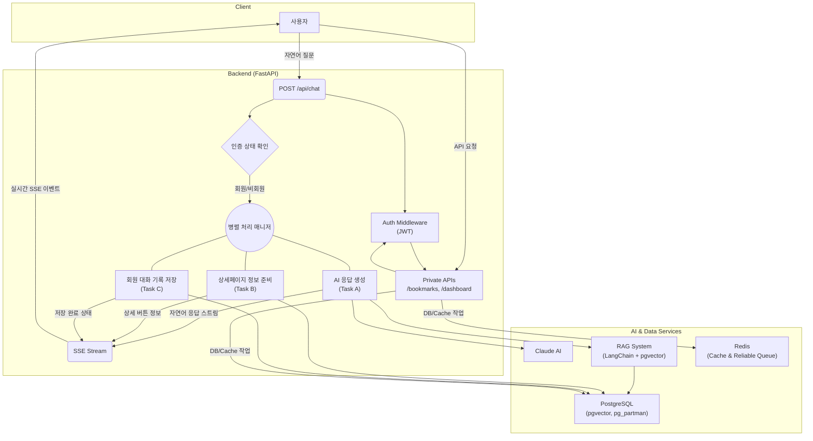

# 🤖 TrAI-Bot : AI 기반 무역 규제 레이더 플랫폼

복잡하고 파편화된 무역 규제 정보를 AI 채팅으로 명쾌하게 해결하고, 실시간 변동사항까지 알아서 챙겨주는 든든한 대화형 무역 정보 파트너입니다. TrAI-Bot은 신뢰할 수 있는 정보를 즉시 제공함으로써 중소기업의 규제 준수 비용과 운영 리스크를 획기적으로 절감하는 것을 목표로 합니다.

-----

### 🔥 무엇을 해결하나요?

수출입 실무자는 정보 부족이 아닌 '정보의 불확실성' 때문에 고통받습니다. TrAI-Bot은 이러한 핵심적인 문제들을 해결합니다.

  * "이 HS코드가 정말 맞을까?" - 확신 부재의 문제

      * 여러 사이트를 뒤져 찾은 정보가 최신인지, 정확한지 확신할 수 없어 잘못된 신고로 인한 관세 추징 및 통관 지연 리스크에 노출됩니다.
      * TrAI-Bot의 해결책 : RAG(검색 증강 생성) 시스템을 통해 AI가 생성하는 답변의 근거를 최신 법령 및 데이터로 제한합니다. 이를 통해 할루시네이션(환각) 현상을 억제하고, 모든 답변에 신뢰할 수 있는 출처를 명시하여 정보의 신뢰도를 극대화했습니다.

  * "내가 놓친 규제는 없을까?" - 보이지 않는 장벽의 공포

      * 수시로 바뀌는 국가별 인증(CE, FCC), 환경 규제 등 '비관세장벽'은 하나만 놓쳐도 전량 폐기, 반송 등 막대한 손실로 이어질 수 있는 숨겨진 지뢰입니다.
      * TrAI-Bot의 해결책 : 북마크 기반 24시간 자동 모니터링과 실시간 SMS/이메일 알림을 통해 사용자가 신경 쓰지 못하는 사이에도 리스크를 감지하고 즉시 알려줍니다.

-----

### ✨ 주요 기능 및 핵심 경험

#### 🎯 경험 1 : 단 한 번의 질문으로 얻는 확신

  * 통합 자연어 질의 : "유럽에 비건 선크림을 수출할 때 필요한 HS코드, 관세율, 필수 인증과 환경 규제가 뭔가요?"와 같이 복잡한 질문을 한 번에 처리합니다.
  * 구조화된 종합 답변 : 프롬프트 체이닝 기법을 통해 AI가 다단계로 추론하고 검증하여, 관세와 비관세 정보를 종합한 체계적인 답변을 제공합니다.
  * AI 사고 과정 투명화 : Claude AI가 어떤 단계를 거쳐 답변을 생성하는지 SSE(Server-Sent Events)를 통해 실시간으로 보여주어 분석 과정의 신뢰도를 높입니다.

#### 👤 경험 2 : 나만을 위한 맞춤형 정보 관리

  * 회원/비회원 차별화 : 회원은 모든 대화 기록이 영구 저장되어 언제든 다시 확인할 수 있으며, 비회원은 세션이나 DB 저장 없이 가볍고 프라이빗한 채팅을 경험할 수 있습니다.
  * 동적 북마크 기능 : AI가 채팅 중 유효한 HS코드나 규제 정보를 감지하면, SSE 스트림의 메타데이터를 통해 실시간으로 북마크 추가 버튼을 생성하여 관심 목록을 손쉽게 구성할 수 있습니다.
  * 개인화 대시보드 : 북마크한 항목들의 최신 현황, 새로운 변동사항 알림, 과거 채팅 기록 등을 한눈에 모아볼 수 있는 나만의 정보 허브를 제공합니다.

#### 🤖 경험 3 : 잠든 사이에도 나를 지켜주는 AI 파트너

  * 24시간 자동 모니터링 : 북마크에 저장된 항목과 관련된 전 세계의 정보 변화(관세율 변경, 규정 강화 등)를 24시간 자동으로 감시합니다.
  * 실시간 SMS/이메일 알림 : "베트남, 철강 품목 반덤핑 관세 15%p 부과 결정"과 같이 AI가 요약한 핵심 정보가 사용자의 휴대폰(SMS)과 이메일로 즉시 발송되어 치명적인 리스크를 사전에 방지합니다.

-----

### 💡 기술 선택 및 이유

저희 팀은 단순히 최신 기술을 나열하는 것이 아니라, 문제 해결에 가장 적합한 도구를 신중하게 선택했습니다. 각 기술 선택의 이유는 다음과 같습니다.

| 분야 | 기술 | 선택 이유 |
| :--- | :--- | :--- |
| Backend | FastAPI, Python | 비동기 처리를 통한 높은 성능, 직관적인 사용법, 자동 API 문서 생성을 통해 AI 모델 연동 및 외부 API 호출이 많은 서비스의 특성에 최적화되었습니다. |
| Frontend | React, TypeScript | 컴포넌트 기반 아키텍처로 복잡한 UI를 효율적으로 관리하고, 정적 타이핑을 통해 코드 안정성과 유지보수성을 확보하기 위해 선택했습니다. |
| Database | PostgreSQL, pgvector, pg_partman | RAG 시스템의 핵심인 벡터 검색을 위해 pgvector를, 대용량 채팅 로그의 성능 저하를 방지하기 위해 pg_partman을 이용한 자동 파티셔닝을 도입하여 확장성을 확보했습니다. |
| AI & RAG | Claude 3, LangChain, Voyage AI | 복잡한 규제 문서 해석에 강점을 보이는 Claude 3를 메인 모델로, LangChain으로 RAG 파이프라인을 구축했습니다. 현재 가장 성능이 좋은 Voyage AI 임베딩 모델로 검색 정확도를 높였습니다. |
| Cache & Queue | Redis | (신뢰성 높은 분산 시스템 설계) 단순 캐싱을 넘어, SMS 인증 요청 시 Atomic-Counters (`HINCRBY`)를 사용해 Race Condition을 제어하고, 신뢰성 있는 큐(Reliable Queue) 패턴을 적용해 알림 메시지의 유실을 방지했습니다. |
| Communication | Server-Sent Events (SSE) | AI의 답변 생성 과정을 실시간으로 보여주기 위해, 양방향 통신이 불필요한 해당 기능에는 WebSocket보다 가볍고 효율적인 SSE를 채택했습니다. |

-----

### 💪 주요 기술적 도전과 해결

이 프로젝트를 진행하며 마주친 주요 기술적 과제와 저희 팀의 해결 방식은 다음과 같습니다.

#### 1. 도전 : 동기(Sync) API와 비동기(Async) 스트리밍 아키텍처의 통합

  * 문제 : 핵심 기능인 채팅은 비동기 SSE 스트림으로 실시간 피드백을 줘야 하지만, 내부적으로 호출하는 일부 API(Context7)는 동기(Sync) 방식으로 동작하여 전체 이벤트 루프를 차단(Blocking)하고 사용자 경험을 저해할 위험이 있었습니다.
  * 해결 
    1.  비동기 래퍼(Async Wrapper) 구현

        동기 API 호출을 `run_in_executor`를 사용한 비동기 래퍼(`Context7AsyncWrapper`)로 감싸, I/O 작업이 메인 스레드를 차단하지 않도록 했습니다.
        
    3.  3단계 병렬 처리 아키텍처 설계
   
        FastAPI의 `BackgroundTasks`와 `asyncio.create_task`를 활용, (A)느린 외부 API 호출 및 정보 분석, (B)빠른 AI 자연어 응답 스트리밍, (C)DB 기록 저장을 독립적인 태스크로 분리하여 동시에 실행했습니다.
        
    5.  즉각적인 UX 피드백
   
        병렬 처리가 시작됨과 동시에 SSE를 통해 "상세 정보 준비 중" 이벤트를 먼저 전송하고, 각 작업이 완료되는 즉시 해당 UI를 업데이트하여 사용자의 체감 대기 시간을 획기적으로 단축했습니다.

#### 2. 도전 : 외부 시스템의 장애 및 예측 불가능성에 대한 방어적 설계

  * 문제 : 외부 API는 응답 시간이 불안정하거나, 예고 없이 응답 데이터 구조가 바뀌거나, 일시적인 장애가 발생할 수 있습니다. 이러한 외부 요인에 의해 우리 시스템 전체가 중단되는 것을 방지해야 했습니다.
  * 해결 
    1.  다단계 폴백(Fallback) 전략 수립
       
        `DetailPageService` 내부에 Cache → 외부 API(Context7) → 자체 폴백 분석기 순서로 동작하는 다단계 폴백 로직을 구현했습니다. 이를 통해 외부 API가 타임아웃되거나 실패하더라도, 시스템은 자체 분석기를 통해 최소한의 핵심 기능을 사용자에게 제공할 수 있습니다.
        
    3.  유연한 데이터 모델링
       
        ydantic 모델에 `extra='ignore'` 설정을 적용하여, 외부 API 응답에 예상치 못한 필드가 추가되더라도 에러 없이 데이터를 파싱하고 필요한 정보만 안전하게 사용할 수 있도록 설계했습니다.
        
    5.  견고한 타임아웃 및 재시도 로직
       
        모든 외부 API 호출에 명시적인 타임아웃(Timeout)을 설정하고, 일시적인 오류에 대응하기 위한 재시도(Retry) 로직을 비동기 래퍼에 내장하여 시스템의 안정성을 높였습니다.

#### 3. 도전 : 대규모 트래픽을 가정한 안정적인 데이터 처리

  * 문제 : 서비스가 성장함에 따라 채팅 로그는 수백만 건 이상으로 증가할 것이며, 단일 테이블에 모든 데이터를 저장할 경우 미래에 심각한 조회 속도 저하가 발생할 것이 분명했습니다.
  * 해결 
    1.  선제적인 데이터베이스 파티셔닝
       
        PostgreSQL의 `pg_partman` 확장 기능을 사용하여 `chat_messages` 테이블을 `created_at`(생성일) 기준으로 매월 새로운 자식 테이블로 자동 분할하도록 설정했습니다. 이를 통해 시스템은 항상 작은 크기의 테이블에서 최신 데이터를 조회하게 되어, 데이터 규모가 커져도 꾸준한 고성능을 유지할 수 있는 확장성을 미리 확보했습니다.
        
    3.  생성된 칼럼(Generated Column) 활용
       
        `bookmarks` 테이블의 `monitoring_active` 칼럼을 `sms_notification_enabled OR email_notification_enabled` 조건의 생성된 칼럼으로 설계했습니다. 이를 통해 데이터의 정합성을 보장하고, 모니터링 대상 필터링 시 별도의 계산 없이 인덱스를 활용한 빠른 조회가 가능하도록 최적화했습니다.

-----

### 🏗️ 시스템 아키텍처

TrAI-Bot은 이벤트 기반의 3단계 병렬 처리 아키텍처를 채택하여 최적의 응답성과 사용자 경험을 보장합니다.



-----

### 🏁 시작하기

로컬 환경에서 프로젝트를 실행하려면 다음 단계를 따르세요.

#### 사전 요구사항

  * Python 3.10+
  * Node.js 18+
  * Docker & Docker Compose
  * PostgreSQL 15+ (pgvector 와 pg_partman 확장 기능이 설치되어 있어야 합니다.)

#### 1. 레포지토리 클론 및 실행

```bash
git clone https://github.com/your-repo/TrAI-Bot.git
cd TrAI-Bot

# .env 파일에 환경 변수 설정

# Docker Compose를 사용하여 모든 서비스(DB 포함)를 한번에 실행
docker-compose up -d --build
```

이제 `http://localhost:5173` 에서 TrAI-Bot을 사용할 수 있습니다. (Vite 기본 포트 기준)

-----

### 🚀 향후 계획
  * 수출입 필요 서류 자동 초안 생성 : AI가 대화 내용을 바탕으로 상업송장(Commercial Invoice), 포장명세서(Packing List) 등의 초안을 자동으로 작성해주는 기능.
  * AI 기반 최적 관세 FTA 컨설팅 : 사용자의 제품이 적용받을 수 있는 가장 유리한 FTA 협정세율을 AI가 찾아주고 추천하는 기능.
  * 글로벌 공급망 리스크 분석 : 특정 국가의 정치, 경제 상황 변화가 사용자의 수출입에 미칠 영향을 분석하고 예측하는 서비스.

-----

### 👨‍👩‍👧‍👦 팀 소개

| 이름 | 역할 | GitHub |
| :--- | :--- | :--- |
| 홍태극 | 팀장, AI Engine 총괄, Backend | [GitHub 프로필](https://github.com/brain1401) |
| 김경보 | Backend, Frontend  | [GitHub 프로필](https://github.com/GodsB1025) |
| 이광원 | Frontend | [GitHub 프로필](https://github.com/Lee-KwangWon) |
| 윤선현 | Frontend | [GitHub 프로필](https://github.com/YOON-SEONHYUN) |
